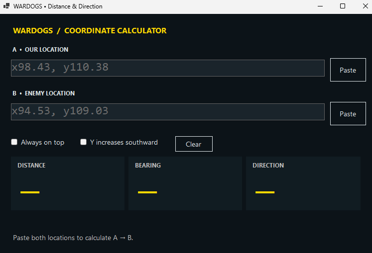

# WARDOGS Calculator

A lightweight Windows desktop calculator for WARDOGS. Paste your position and a target position to calculate the distance, bearing, and compass direction between them.

Built with C# and Windows Forms on .NET 8.

## Download and run

**[Download WardogsCalculator.exe for Windows x64](https://github.com/c0dewars/Wardogs_calculator/releases/download/v0.1.0/WardogsCalculator.exe)**

1. Open the [v0.1.0 release page](https://github.com/c0dewars/Wardogs_calculator/releases/tag/v0.1.0).
2. Under **Assets**, select **WardogsCalculator.exe**. The source-code archives are for developers, not the ready-to-run application.
3. Save the executable in a folder of your choice.
4. Double-click **WardogsCalculator.exe** to open the calculator.

No installation, administrator privileges, or separate .NET installation is required for this standalone build.

## How to use



The grey coordinate examples shown in the empty fields are placeholders, not entered locations. Paste both locations to show a result.

1. Copy your position's X/Y coordinate text from the game.
2. Paste it into **A — Our location**, using the **Paste** button or **Ctrl+V**.
3. Copy the enemy or target position and paste it into **B — Enemy location**.
4. Read the results, which update automatically:
   - **Distance:** straight-line distance from A to B in metres.
   - **Bearing:** direction from A to B in degrees, clockwise from north.
   - **Direction:** the nearest of eight compass directions.
5. Keep A unchanged while updating B for new targets. Update A whenever your firing position changes.

Enable **Always on top** to keep the calculator above other normal windows. Use borderless/windowed gameplay or a second monitor if exclusive fullscreen hides the calculator. **Clear** empties both inputs.

Enable **Y increases southward** only if larger Y coordinates correspond to south on the map. The default assumes Y increases northward. This changes the bearing, not the distance.

## Features

- Two coordinate inputs: **A — Our location** and **B — Enemy location**.
- Paste buttons and standard Ctrl+V support.
- Decimal dots and commas, including mixed formats.
- Large distance, bearing, and direction displays that update as inputs change.
- East/west and north/south distance breakdown.
- Optional always-on-top window and configurable Y-axis orientation.
- Offline operation, with calculations triggered only by input changes.

## Requirements

- Windows x64 for the standalone executable.
- .NET 8 SDK or a newer compatible SDK to build from source.

The standalone build includes its runtime. Windows Forms does not run natively on macOS or Linux.

## Run from source

Open a terminal in the project folder:

```powershell
dotnet run --project WardogsCalculator.csproj
```

Alternatively, open `WardogsCalculator.csproj` in Visual Studio with the .NET desktop development workload installed.

## Build a standalone executable

Double-click `Build-Windows.cmd`. The script publishes the application, runs its self-tests, and opens the output folder.

The executable is created at:

```text
publish/WardogsCalculator.exe
```

Copy the executable to a Windows x64 PC and double-click it to run. No installer or separate .NET runtime is required. The first build requires internet access to restore dependencies.

To publish manually:

```powershell
dotnet publish WardogsCalculator.csproj -c Release -r win-x64 --self-contained true -p:PublishSingleFile=true -p:IncludeNativeLibrariesForSelfExtract=true -p:DebugType=None -p:DebugSymbols=false -o publish
```

## Coordinate input

Paste one coordinate pair into each input. Supported examples:

```text
x98.43, y110.38
x98.43, y110,38
x98,43, y110,38
A= x98.43, y110.38
X:98.43 Y:110.38
```

Decimal commas are normalized within each number. The separator between the X and Y coordinates is preserved. Invalid or incomplete input clears the previous result.

### Example

| Position | Coordinates |
| --- | --- |
| A | `x98.43, y110.38` |
| B | `x94.53, y109.03` |

With Y increasing northward:

| Output | Result |
| --- | --- |
| Distance | 412.70 m, displayed as 413 m |
| Bearing | 250.9°, displayed as 251° |
| Compass direction | W |
| Offset | 390 m west and 135 m south |

## Calculation conventions

Each coordinate unit represents **100 metres**. X increases eastward. Y defaults to increasing northward; enable **Y increases southward** when appropriate for the map.

```text
east  = (Bx - Ax) × 100
north = (By - Ay) × 100
range = sqrt(east² + north²)
bearing = (atan2(east, north) × 180 / π + 360) mod 360
```

When Y increases southward, the north component is negated. Bearings are clockwise from north: 0° north, 90° east, 180° south, and 270° west. Compass labels use eight sectors. Coincident positions have no bearing or direction.

Confirm the coordinate scale and Y-axis orientation against known positions in the game.

## Tests

Run the parser and calculation self-tests:

```powershell
dotnet run --project WardogsCalculator.csproj -- --self-test
```

The tests cover decimal dots and commas, invalid input, sample distance, cardinal bearings, reversed Y-axis orientation, and coincident positions. Successful tests exit without opening a window; failed tests throw an exception.

## Limitations

- Always on top uses a standard Windows window. Exclusive fullscreen may hide it; use borderless/windowed mode or a second monitor.
- The application does not read game memory, capture the screen, or inject an overlay.
- Mortar elevation is not calculated; it requires weapon-specific calibration data.
- Resource usage has not been benchmarked. Windows display scaling and layout require verification on the target PC.

This is an independent utility and is not affiliated with WARDOGS.
